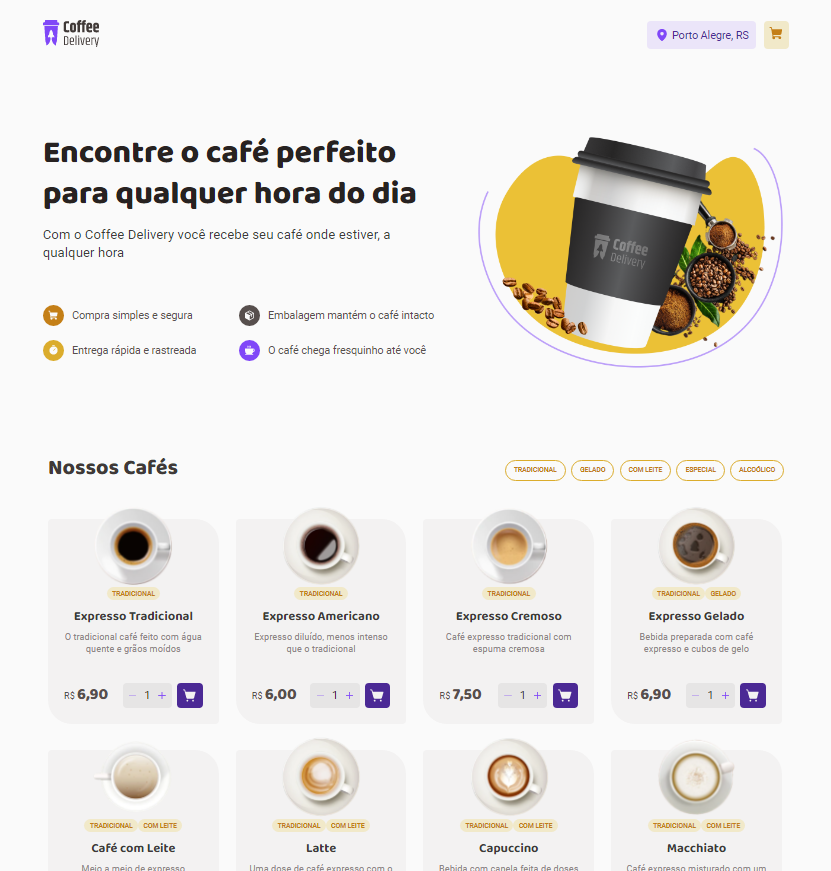

<h1 align="center">

</h1>

<h3 align="center">
  Criando uma cafeteria fictícia com ReactJS/Typescript
</h3>

<p align="center">
  <a href="https://www.linkedin.com/in/rnatu/">
    
  </a>
</p>

<p align="center">
Desenvolvi uma aplicação para gerenciar um carrinho de compras de uma cafeteria fictícia do zero, utilizando ReactJS e TypeScript como base.
</p>

<p align="center">
  <a href="#-sobre-o-projeto">Sobre o projeto</a>&nbsp;&nbsp;&nbsp;|&nbsp;&nbsp;&nbsp;
  <a href="#-tecnologias-utilizadas">Tecnologias utilizadas</a>&nbsp;&nbsp;&nbsp;|&nbsp;&nbsp;&nbsp;
  <a href="#-Como-utilizar">Como utilizar</a>
</p>

<h3 align="center">
  Acesse a aplicação pelo link abaixo<br />
   <font size="4">
   <a  href="https://exquisite-stroopwafel-262dd1.netlify.app">
  https://exquisite-stroopwafel-262dd1.netlify.app
  </a>
  </font>
</h3>

## 📜 Sobre o projeto

Nesta aplicação o meu principal objetivo foi criar uma aplicação para gerenciar um carrinho de compras, criando a interface através de um layout previamente construído, buscando deixar o mais próximo possível e funcional.

<p align="center">
  
</p>

### Principais funcionalidades implementadas

- Listagem de produtos (cafés) disponíveis para compra
- Adicionar uma quantidade específicas de itens no carrinho
- Aumentar ou remover a quantidade de itens no carrinho
- Formulário para o usuário preencher o seu endereço
- Exibir o total de itens no carrinho no Header
- Exibir o valor total da soma de itens no carrinho multiplicados pelo valor

#### Funcionalidades Adicionais

- Filtro de cafés por tag
- validação para exibição de rotas

#### Conceitos

- Estados
- ContextAPI
- Reducer
- LocalStorage
- Imutabilidade do estado
- Listas e chaves no ReactJS
- Propriedades
- Componentização

## 🚀 Tecnologias utilizadas

- [ReactJS](https://pt-br.reactjs.org/)
  - [styled-components](https://styled-components.com/)
  - [phosphor-icons](https://phosphoricons.com/)
  - [immer](https://immerjs.github.io/immer/)
  - [React Hook Form](https://react-hook-form.com/)
  - [zod Validations](https://zod.dev/)
  - [react-router-dom](https://reactrouter.com/en/main)
  - [uuid](https://github.com/uuidjs/uuid)
- [TypeScript](https://www.typescriptlang.org/)
- [Vite](https://vitejs.dev/)

Code formatter:

- [esLint](https://eslint.org/)

## ⚡ Como utilizar

### Instalando Dependências

```bash
    # Instalar as dependências
    $ npm i
```

### Iniciando aplicação

```bash
    # Iniciando aplicação
    $ npm run dev

    # A aplicação será aberta na porta:3000 - Basta acessar: http://localhost:5173/
```

<h4 align="center">
    Made with 💜 by Renato Xavier
</h4>
